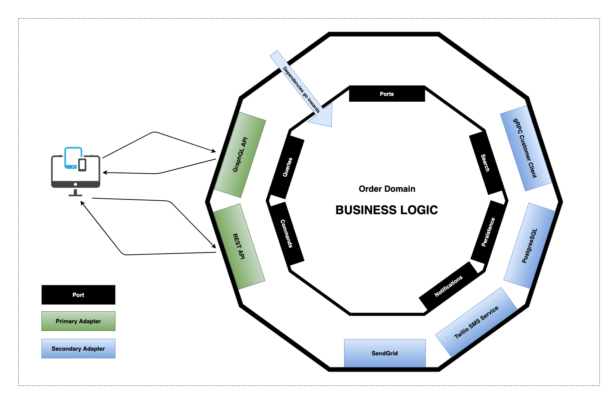

# Hexagonal Architecture / Ports & Adapters Pattern (PoC)

This repository demonstrates my Hexagonal architecture implementation in Java/Spring application.

## Table of Content

- [Ports & Adapters Pattern](#ports--adapters-pattern)
- [Order Service](#order-service)
  * [Application Diagram](#application-diagram)
- [Project package structure](#project-package-structure)
- [Getting Started](#getting-started)
  * [Prerequisite](#prerequisite)
  * [Installation](#installation)
- [Important Endpoints](#important-endpoints)
- [References](#references)
- [License](#license)

## Ports & Adapters Pattern

> Allow an application to equally be driven by users, programs, automated test or batch scripts, and to be developed and tested in isolation from its eventual run-time devices and databases.
>
> As events arrive from the outside world at a port, a technology-specific adapter converts it into a usable procedure call or message and passes it to the application. The application is blissfully ignorant of the nature of the input device. When the application has something to send out, it sends it out through a port to an adapter, which creates the appropriate signals needed by the receiving technology (human or automated). The application has a semantically sound interaction with the adapters on all sides of it, without actually knowing the nature of the things on the other side of the adapters.
>
> -- <cite>[Alistair Cockburn][1]</cite>

[1]: https://alistair.cockburn.us/hexagonal-architecture/

## Order Service

Order Service is a simple microservice that allows customers to manage orders via REST or GraphqlQL API.

### Application Diagram



## Project package structure

```shell
+-- api:  # Application Provider Interface - contains primary/driving adapters.
|   +-- graphql # GraphQL primary adapter classes.
|   +-- rest # Rest primary adapter classes.
+-- business # core of our application. Contains pure domain business logic, doesn't have any external dependencies. All communications goes through ports.
|   +-- common # shared configuration.
|   +-- customers # customers feature.
|   +-- notifications # notifications feature.
|   +-- orders # orders feature.
+-- config # common Spring configuration.
+-- spi # Service Provider Interface - contains secondary/driven adapters.
|   +-- grpc # fake gRPC client adapter.
|       +-- customers # customers feature.
|   +-- postgres # PostgreSQL adapter.
|       +-- config # postgres configuration classes.
|       +-- orders # orders feature.
|   +-- sendgrid # fake Sendgrid adapter.
|   +-- twilio # fake Twilio adapter.
```
*** *One of many ways to structure your packages, always discuss and agree inside Your team;)*

## Getting Started

### Prerequisite

* Java 11
* PostgreSQL
* Docker

### Installation

* **H2:**
  ```shell
  ./gradlew bootRun
  ```
* **PostgreSQL:**
  ```shell
  # Start docker compose with PostgresSQL and Adminer
  docker-compose -f ./docker/docker-compose.yml up -d  
  
  # Start order service with 'docker' profile
  ./gradlew bootRun --args='--spring.profiles.active=docker'
  ```

## Important Endpoints

| Name | Endpoint | 
| -------------:|:--------:|
| `Order Service - GraphiQL` | http://localhost:8080/graphiql |
| `Order Service - Swagger UI` | http://localhost:8080/swagger-ui.html |
| `Order Service - H2 console` | http://localhost:8080/h2-console |
| `Adminer` | http://localhost:7775/ |

## References

* [Alistair Cockburn - Hexagonal Architecture](https://alistair.cockburn.us/hexagonal-architecture/)
* [Netflix Blog - Ready for changes with Hexagonal Architecture](https://netflixtechblog.com/ready-for-changes-with-hexagonal-architecture-b315ec967749)
* [More Testable Code with the Hexagonal Architecture](https://www.youtube.com/watch?v=ujb_O6myknY)
* [How to implement equals and hashCode using the JPA entity identifier (Primary Key)](https://vladmihalcea.com/how-to-implement-equals-and-hashcode-using-the-jpa-entity-identifier/)
* [Service provider interface](https://en.wikipedia.org/wiki/Service_provider_interface)

## License

Distributed under the MIT License. See `LICENSE` for more information.
